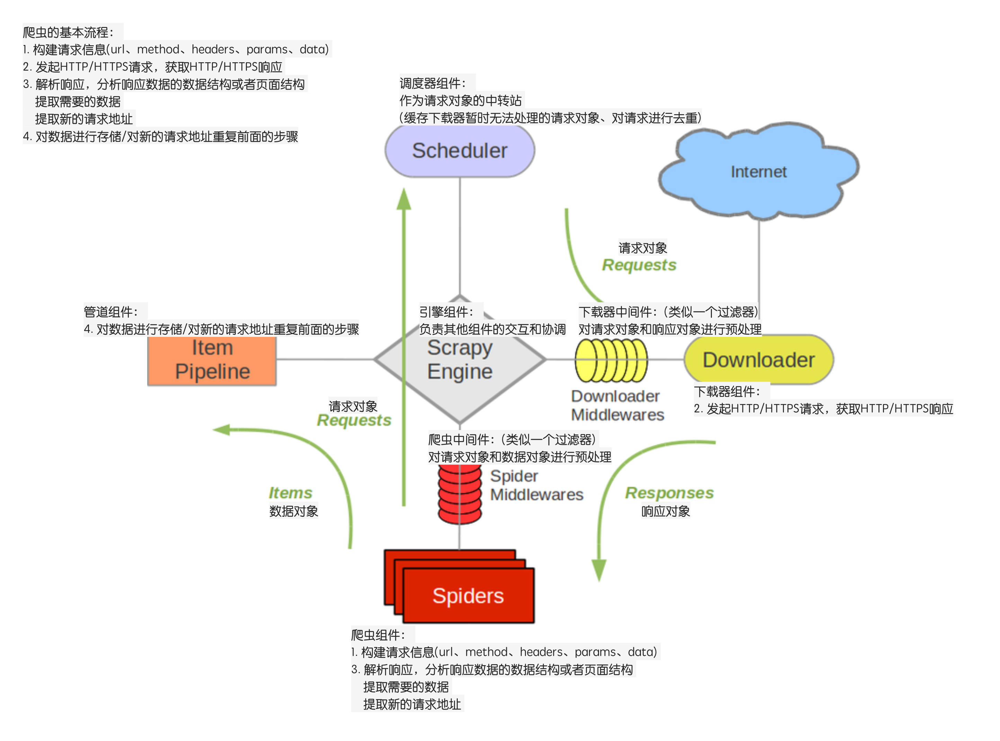

### 参照Scrapy框架流程图进行分析


### 框架基本结构
1. 三个内置对象
    - 请求对象（Request）
    - 响应对象（Response）
    - 数据对象（Item）

2. 五个核心组件
    - 爬虫组件
        - 构建初始请求信息，生成请求对象
        - 解析响应对象，返回数据对象或新的请求对象
    - 调度器组件
        - 缓存请求对象，为下载器提供请求对象，实现请求调度
        - 对请求对象进行去重
    - 下载器组件
        - 根据请求对象，发起HTTP/HTTPS网络请求，获取响应数据，构建相应对象
    - 管道组件
        - 负责处理数据对象，进行数据的清洗、持久化存储等等
    - 引擎组件
        - 负责驱动各大组件，通过调用各组件对外提供的API接口，实现各组件间的交互与协作
        - 提供整个框架的启动入口
    
3. 两个中间件
    - 爬虫中间件
        - 对请求对象和数据对象进行预处理
    - 下载器中间件
        - 对请求对象和响应对象进行预处理
    
### 编写setup.py将框架安装到python环境中
```
python setup.py install
```


### 框架的拓展
- 框架配置文件，实现框架可配置化
- 多个爬虫的启动
- 多个管道对各自的爬虫数据进行存储
- 多个中间件对各自爬虫做定制化的预处理
- 日志模块的集成
- 请求的去重
- 异步爬去数据